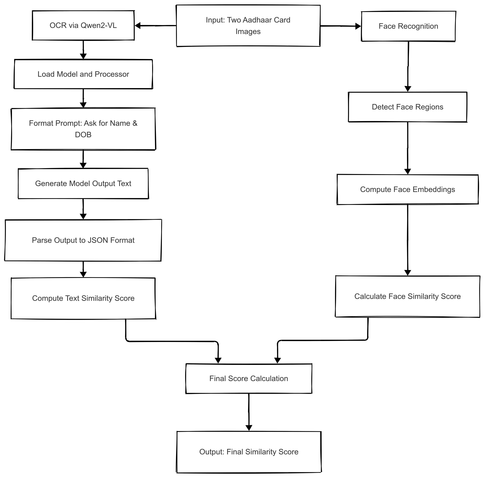

# Aadhaar Document Similarity Scoring System

## This project provides a system to compare two Aadhaar card (front faced) images based on both **face similarity** and **textual similarity** (Name and Date of Birth). It uses `face_recognition` for face comparison and the `Qwen2-VL` multi-modal LLM model for extracting text information directly from images.

## Workflow

## 

## Features

- Face detection and embedding-based similarity
- Vision-language inference using Qwen2-VL
- Text similarity scoring via fuzzy string matching
- Weighted final score combining face and text
- Jupyter notebook-based analysis and pipeline
- Designed for extensibility and API integration (FastAPI-ready)

---

## Tech Stack

- Python 3.10+
- face_recognition
- Transformers by Hugging Face
- Qwen/Qwen2-VL-2B-Instruct
- Matplotlib (for image visualization)
- Difflib, Regex, AST (for text parsing & comparison)

---

## Project Structure

```
identity-similarity/
├── analysis/
├── app/
│   ├── __init__.py
│   ├── main.py
│   ├── .env
│   ├── api/
│   │   ├── __init__.py
│   │   └── routes.py
│   ├── core/
│   │   ├── __init__.py
│   │   └── logger.py
│   ├── services/
│   │   ├── __init__.py
│   │   ├── face.py
│   │   ├── text.py
│   │   └── score.py
│   └── models/
│       ├── __init__.py
│       └── schemas.py
├── Dockerfile
├── requirements.txt
└── README.md
```

## Installation

#### 1. Clone the Repository

```bash
git clone https://github.com/AnisH521/identity_similarity_app.git
cd identity-similarity
```

#### 2. Install Dependencies

```bash
pip install -r requirements.txt
```

Create a `.env` file within `app/.env` and put you API Key within it

```bash
# GEMINI_API_KEY
GEMINI_API_KEY=************************
```

#### Running the Application

Start the API server:

```bash
uvicorn app.main:app --reload
```

#### Docker Options

Built the image

```bash
docker build -t name-of-docker-image .
```

Run the Container

```bash
docker run -p 8000:8000 name-of-docker-image
```

The API will be available at http://localhost:8000, and the interactive API documentation at http://localhost:8000/docs.

## API Endpoints

### Compare Identity Documents

```
POST /api/compare
```

Upload two identity document images and get a comprehensive comparison report.

### Face Similarity

```
POST /api/face-similarity
```

Calculate similarity between faces in two images.

### Text Extraction

```
POST /api/text-extraction
```

Extract textual information from identity document images.

## Response Format

```json
{
  "face_score": 0.26,
  "text_score": 0.12,
  "overall_score": 0.2
}
```

## License

[MIT](LICENSE)

## Acknowledgements

- [FastAPI](https://fastapi.tiangolo.com/)
- [face_recognition](https://github.com/ageitgey/face_recognition)
- [Qwen2-VL](https://huggingface.co/Qwen/Qwen2-VL-7B-Instruct)
